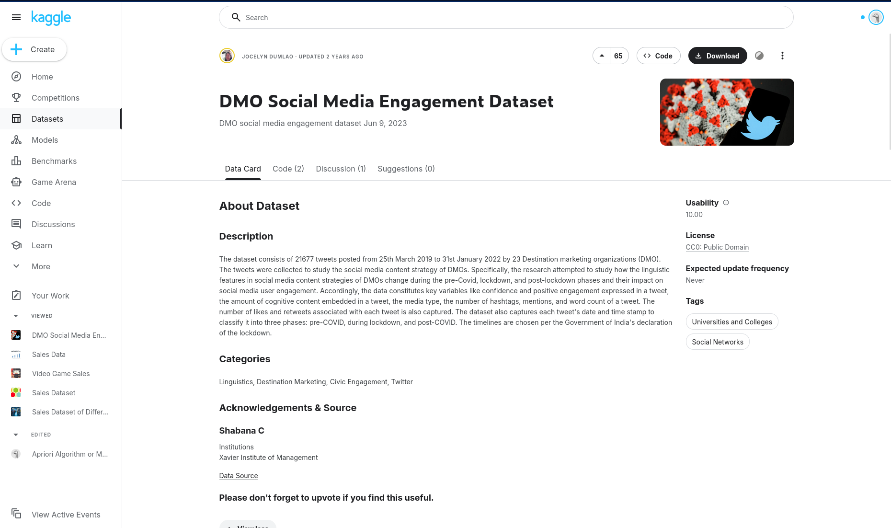
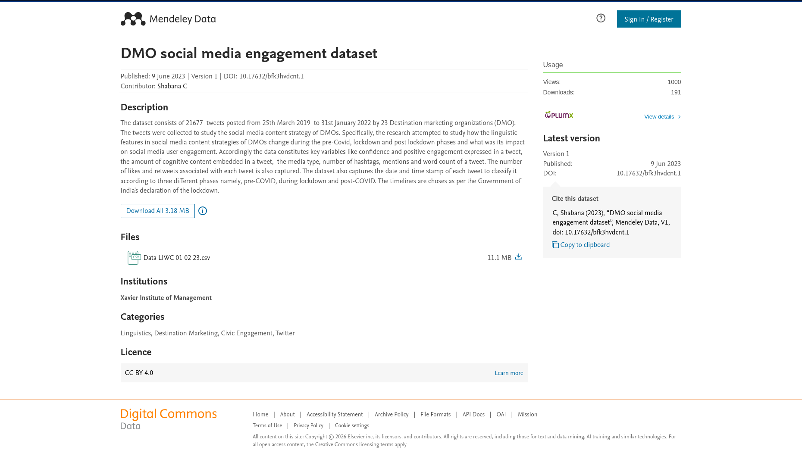

# Social Media Sentiment Business Intelligence Analytics

## Problem Statement

Social media platforms like Twitter are widely used by organizations to engage with audiences. However, it is often unclear which factors such as content type, posting time, sentiment, or audience size drive higher engagement (likes, replies, and retweets). This project analyzes a dataset of tweets from Destination Marketing Organizations to identify patterns and factors that influence social media engagement.


## Business Questions

1. **Influencer Impact:** How does influencer status affect tweet engagement?
2. **Content Performance:** Which post type generates the highest engagement?
3. **Phase Shifts:** How did engagement patterns change across different phases (pre-COVID, lockdown, post-COVID)?
4. **Peak Activity:** Which day of the week and hour has more engagement across different phases?
5. **Geography & Influence:** Which state has the influencers with the highest number of followers on average?
6. **Sentiment Analysis:** Which influencer type has the most negative/positive sentiments?
7. **Behavioral Patterns:** What post types do different influencers post?
8. **Regional Engagement:** Which states have the highest post engagement?
9. **Length vs. Impact:** Does word count (WC) influence engagement levels?
10. **Verbosity vs. Impact:** Does verbosity influence engagement levels?
11. **Timeline Trends:** How do engagement levels change over time?

## Visuals

### Slicers

- Day
- Open_Hours
- Phase (4_Phase)
- Post_Type
- Content_Type
- Influencer_Status
- Verbosity

### Graphs

1. Influencer & Sentiment Deep-Dive

    - Influencer Engagement (Radar Chart): Disaggregated by Phase.

    - Influencer Engagement (Bar Chart): Disaggregated by Verbosity.

    - Influencer Sentiment (Waterfall Chart): Positive vs. Negative sentiments by influencer type.

    - Follower Density (Bar Chart): Top N states with highest average influencer followers.

    - Influencer Behavior (Radar Chart): Post type distribution per influencer.

2. Content & Performance Metrics

    - Type Performance (Column Chart): Disaggregated by Content_Type.

    - Word Count Analysis (Scatter Plot): Engagement vs. Word Count (WC).

    - Verbosity Impact (Combo Line & Bar Chart): Engagement levels across verbosity categories.

    - Regional Performance (Bar Chart): Top N states by post engagement.

3. Temporal & Phase Analysis

    - Phase Distribution (Box Plot): Engagement patterns across pre-COVID, lockdown, and post-COVID.

    - Engagement Hotspots (Heatmap):   
        ```
        X-axis: Phase   
        Y-axis: Day + Open_Hours   
        Values: Engagement
        ```

    - Trend Timeline (Line Chart): Engagement levels over Date.


## Data Sources

Dataset: DMO Social Media Engagement Dataset

Source: Kaggle

Accessed via Kaggle:
https://www.kaggle.com/datasets/jocelyndumlao/dmo-social-media-engagement-dataset



Primary Source:
https://data.mendeley.com/datasets/bfk3hvdcnt/1



This dataset contains 21,677 tweets collected from 23 Destination Marketing Organizations (DMOs) between March 25, 2019 and January 31, 2022. It was created to study how social media content strategies and linguistic features affect user engagement on Twitter. 

## Data Model Description

The project uses a star schema data model designed to analyze social media engagement. In this model, a central fact table stores engagement metrics for tweets, while several dimension tables provide contextual information such as time, content type, influencer status, and posting characteristics.

### Tables in the Data Model

The model consists of one fact table and several dimension tables:

Fact_SocialMediaEngagement – Contains the main quantitative metrics such as engagement counts, follower counts, sentiment scores, and linguistic features.
- Dim_Date - Stores date-related attributes used for time-based analysis.
- Dim_State - Represents the geographic location associated with each tweet.
- Dim_PostType - Contains the different types of posts (Photo, Video, Text, Link, Poll).
- Dim_ContentType - Describes the category of content shared in the tweet.
- Dim_Phase - Represents the campaign or timeline phase of the post.
- Dim_OpenHours - Indicates whether a tweet was posted during working or non-working hours.
- Dim_Day - Identifies the day of the week.
- Dim_DayType - Distinguishes between weekdays and weekends.
- Dim_InfluencerStatus - Indicates whether the account is classified as an influencer.

These dimension tables provide descriptive context that allows engagement metrics in the fact table to be analyzed across different categories such as time, content type, and posting characteristics.

## Data Model Diagram

