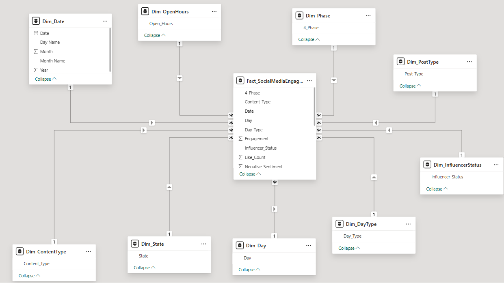

# Social Media Sentiment Business Intelligence Analytics

## Problem Statement

Social media platforms like Twitter are widely used by organizations to engage with audiences. However, it is often unclear which factors—such as content type, posting time, sentiment, or audience size—drive higher engagement (likes, replies, and retweets). This project analyzes a dataset of tweets from Destination Marketing Organizations to identify patterns and factors that influence social media engagement.

## Business Questions
The analysis aims to answer the following questions:
1.	How does influencer status affect tweet engagement?
2.	Which generates the highest engagement?
3.	How did engagement patterns change across different phases (pre-COVID, lockdown,        post-COVID)?
4.	Which day of the week has more engagement?
5.	Which state has the influencers with highest number of followers based on average?
6.	Which influencer type have most negative /positive sentiments?
7.	Does posting during working hours or non-working hours affect engagement?
8.	Do tweets posted on weekends perform differently than weekdays?
9.	What content type does different influencers post?
10.	In what state when posts are made that have the highest engagement?
11.	Does word count (WC) influence engagement levels?

## Data Sources

Dataset: DMO Social Media Engagement Dataset

Source: Kaggle

Accessed via Kaggle:
https://www.kaggle.com/datasets/jocelyndumlao/dmo-social-media-engagement-dataset

Primary Source:
https://data.mendeley.com/datasets/bfk3hvdcnt/1

This dataset contains 21,677 tweets collected from 23 Destination Marketing Organizations (DMOs) between March 25, 2019 and January 31, 2022. It was created to study how social media content strategies and linguistic features affect user engagement on Twitter. 

## Data Model Description

The project uses a star schema data model designed to analyze social media engagement. In this model, a central fact table stores engagement metrics for tweets, while several dimension tables provide contextual information such as time, content type, influencer status, and posting characteristics.

## Data Model Diagram
()
