# Business Insights

## How has Engagement Grown over Time by Year and Month?

This line chart tracks the Engagement Growth Trend across 2020–2022. It plots the period-over-period change rate, revealing where growth accelerated or declined.
  
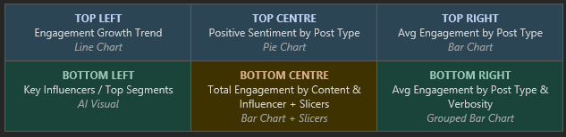
 
### Findings

**2020 Volatility:** The chart shows extreme swings early in 2020, with growth spiking sharply positive before dropping to its most negative point (approximately –4), consistent with the disruption of COVID lockdowns creating an initial content surge followed by audience fatigue.

**2021 Stabilisation:** Growth rates moderate significantly through 2021, oscillating in a tighter band around zero. This reflects audiences re-establishing regular consumption patterns as restrictions eased.

**2022 Plateau:** By 2022, the growth trend flattens and hugs the zero line, indicating that engagement levels have stabilised rather than growing. The market appears to have reached a post-pandemic equilibrium.

**Negative Dip (Mid-2020):** The most dramatic negative trough,
around –4, aligns with peak lockdown fatigue. Even as audiences were home and online, overall engagement growth collapsed, mirroring findings from the box plot analysis of COVID phases.

## How is Positive Sentiment Distributed across Post Types?

This pie chart breaks down the total sum of Positive Sentiment by Post Type, showing which content formats collectively generate the most positive audience response.

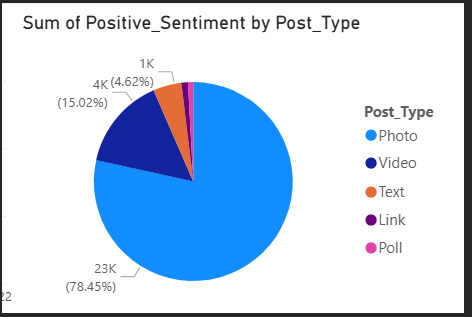

### Findings
**Photo dominates overwhelmingly:** With 78.45% (23K) of all positive sentiment, Photo posts are by far the most positively received content format. This aligns with the finding that photo is also the most frequently posted type across all influencer tiers.

**Video holds a meaningful share:** Video accounts for a notable secondary slice, confirming its elevated engagement performance observed in the stacked column chart analysis. Audiences respond positively even though video is rarely used.

**Text posts contribute modestly:** Text represents 15.02% (4K) of positive sentiment, respectable given it is the second most commonly used post format, though far behind photo.

**Link and Poll are negligible:** Together, Link (4.62%, 1K) and Poll account for a very small fraction of positive sentiment, confirming that these formats rarely resonate with audiences across the dataset.

## Which Post Type Generates the Highest Engagement?

This bar chart compares the Average of Engagement across five post types: Text, Video, Photo, Link, and Poll; giving a fair, volume-neutral comparison of which format resonates most per post.

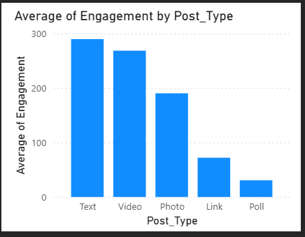

### Findings
**Text leads on average:** Counterintuitively, Text posts register the highest average engagement (approximately 285), edging out Video in this view. This may be driven by a small number of high-performing text posts inflating the average, or by the fact that text posts from high-tier influencers skew the mean.

**Video is a close second:** Video averages approximately 265 engagements, confirming its strong performance. Combined with the stacked column findings (where Video has the highest engagement per tier), Video remains a premium-performing format.

**Photo performs well in volume but modestly in average:** Despite dominating total sentiment and posting volume, Photo's average engagement (~190) sits below both Text and Video, suggesting diminishing returns as photo volume increases.

**Link performs below expectations:** With an average around 65, Link posts generate relatively low engagement, suggesting audiences on this platform are reluctant to leave for external content.

**Poll barely registers:** Poll has the lowest average engagement of all post types, confirming it as the least effective format in this dataset.

## What Factors most Influence the Likelihood of a Post being Classified as a Photo?

This Power BI Key Influencers visual identifies the conditions under which a post is most likely to be a Photo post, quantifying each factor's multiplicative impact on that likelihood.

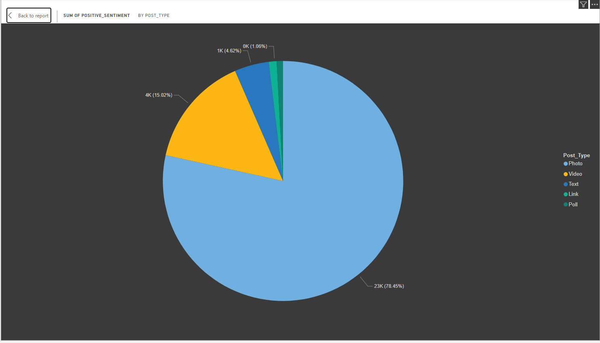

 
### Findings
**Word Count (7.91×):** When the Average Word Count goes up by 8.84 words, the likelihood of the post being a Photo increases by 7.91 times. This is the single strongest driver. It may initially seem counterintuitive — one might expect photos to accompany short captions — but it suggests that photo posts in this dataset tend to carry longer descriptive captions or hashtag-heavy text.

**Negative Sentiment (2.18×):** When Average Negative Sentiment decreases by 0.02, the likelihood of a Photo post increases by 2.18 times. Lower negativity is associated with photo content, reinforcing the idea that photo posts tend to be more positive and polished in tone.

**Engagement (1.01×):** When Average Engagement decreases by 103.38, the likelihood of a Photo post increases marginally (1.01×). This is a near-neutral effect — engagement alone is not a meaningful predictor of photo format selection.

## How does Total Engagement compare Across Content Types for Different Influencer Tiers?

This chart compares Total Engagement for Information and Interaction content types across different influencer groups.

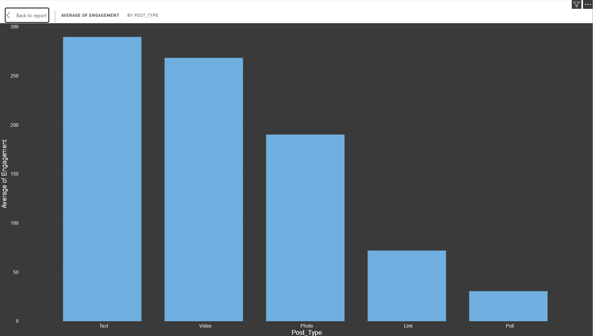

### Findings

**Interaction content leads for both groups:** Both Celebrity and Macro Influencer bars are longer for Interaction content than for Information content. This universally confirms that audience engagement is higher when content is interactive rather than purely informational — consistent with the verbosity and stacked column analyses.

**Celebrities generate more total engagement in Interaction:** Celebrity Interaction bars extend noticeably further (approaching ~2M total engagements) compared to Macro Influencer Interaction, reinforcing the tier-based engagement hierarchy.

**Information content is more evenly matched:** The gap between Celebrities and Macro Influencers narrows for Information content, suggesting that the celebrity advantage is more pronounced for interactive posts.

**Celebrity advantage is format-dependent:** Celebrities do not simply outperform across the board, their lead is most pronounced in Interaction content, suggesting their audiences engage most when the content invites a response rather than delivers information.

 
## How does Verbosity Interact with Post Type to affect Engagement?

This grouped bar chart cross-analyses Average Engagement by both Post Type and Verbosity level (Extreme, High, Low, Medium), revealing whether the optimal word count varies by the type of post being created.

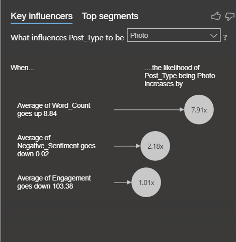

### Findings

**Text at Extreme verbosity peaks dramatically:** The most striking finding is that Text posts at Extreme verbosity (purple bar) reach nearly 1,000 average engagement — far above any other combination in the chart. This is an outlier result suggesting that long-form text content, when it does break through, generates outsized engagement.

**Video performs consistently across verbosity levels:** Video posts maintain strong average engagement across all verbosity levels, with the Medium and Low categories performing particularly well (~300–500). This reinforces video's position as the most reliable high-performing post format.

**Photo shows moderate, stable performance:** Photo posts deliver consistent but moderate engagement across all verbosity levels, with no single verbosity category dramatically outperforming others. Photo remains a volume format rather than an engagement spike driver.

**Link and Poll remain low across all verbosity levels:** Regardless of how much text accompanies them, Link and Poll posts generate very low engagement. Verbosity cannot rescue underperforming formats.

**Extreme verbosity is high-risk, high-reward:** The extreme verbosity category shows the widest spread of results — from very high (Text) to very low (Link/Poll). Short to medium captions appear safer for most formats.

## What Post Type do Different Segment Influencers Post?

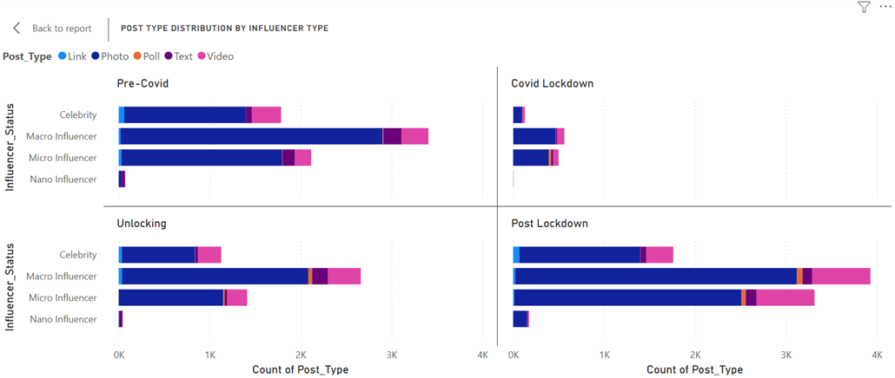

### Findings

**Photos dominate:** Photos are the main content type for all influencer tiers at all times.

**Macro influencers lead:** They post the most, peaking at nearly 4,000 posts after lockdown.

**Nano influencers lag:** They post the least, rarely going above 200 posts.

**Pandemic drop:** Posting decreased significantly during lockdown for all tiers.

**Strong recovery:** Activity increased after lockdown, with Macro and Micro influencers surpassing pre-Covid levels.

**Micro vs Celebrity:** Micro influencers post more than Celebrities, especially before and after lockdown. 

## Which States have Socialites the Highest Number of Followers?

For this chart, we look at which regions drive the highest follower count; three states stand out: Kerala, Gujarat, and Odisha.
Insights: What makes these states unique in the data is that their high average follower counts are driven exclusively by Celebrity influencers. We don’t see a mix of smaller tiers reaching these numbers in these regions.

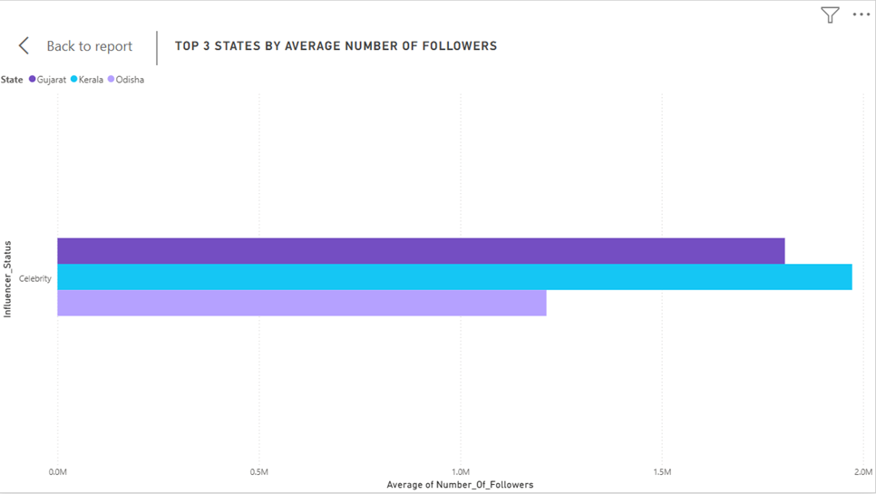

### Findings

- Massive follower reach in these specific states is highly dependent on "Celebrity" status rather than a broad base of smaller creators.
- High-follower influence is not evenly distributed across the map; instead, it is geographically concentrated, with these three states acting as the primary hubs for the most followed influencers in our dataset.

##  How does Influencer Status affect Engagement across Phases?

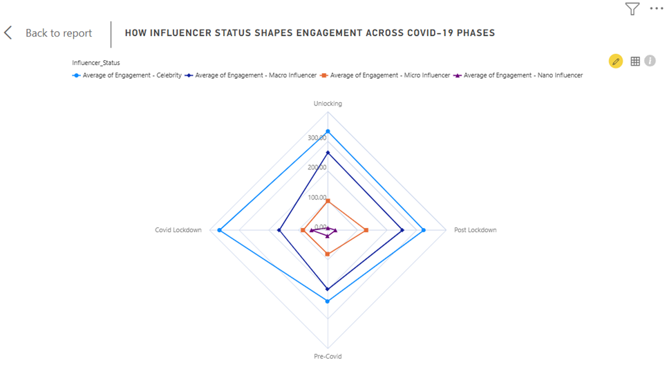

For this chart, we are looking at the engagement across the 4 COVID-19 phases and how it affects each influencer type.

### Findings

**Celebrities:** We can see that they are in a league of their own. This is because they lead in every single phase. When everyone was stuck at home, their content was a go-to for most people. Their lowest was pre-COVID, which is still higher than almost anyone else's peak.

**Macro Influencers:** They mirror the celebrities but on a smaller scale. Their performance peaked during the Unlocking phase, suggesting their content resonated most as people began transitioning back to normal life.

**Micro Influencers:** They saw their best results in the Post-Lockdown Period, which indicates that their engagement wasn’t tied to a global crisis; instead, it grew as people settled back into their post-pandemic routines.

**Nano-Influencer:** They occupy the smallest area on the chart. While they saw a relatively high level during the COVID lockdown, their engagement dropped to its lowest point during the Unlocking phase.

## How did Engagement Patterns Change across COVID Phases?

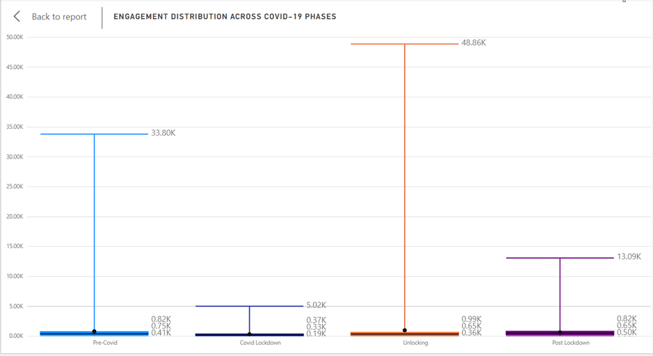

### Findings

**The "Pre-Covid" Baseline:** Before the pandemic, engagement was naturally high, peaking at 33.80K.This represents our 'normal' world where people were consistently active and engaging with content at a high level.

**The "Lockdown" Crash:** During the Lockdown, engagement plummeted to its lowest point of 5.02K. When the lockdowns hit, engagement crashed. The pandemic effectively 'froze' activity, likely because people shifted their focus away from this specific type of content toward survival or essential needs.

**The "Unlocking" Explosion:** As soon as restrictions lifted, engagement hit an all-time record of 48.86K.This is the most interesting part. Once the world started 'Unlocking,' we saw a massive 'Rebound Effect.' The levels were even higher than before the pandemic as people rushed back to their old habits.

**The "Post-Lockdown" Reality:** Currently, engagement has settled at 13.09K, which is much lower than the original Pre-Covid levels. Finally, we see the 'New Normal.' Even though the surge was huge, it didn't last.People have adjusted to a new reality where engagement is much lower than before, suggesting that the pandemic caused a lasting shift in how people interact with content.

## How do Engagement Levels Change over Time?

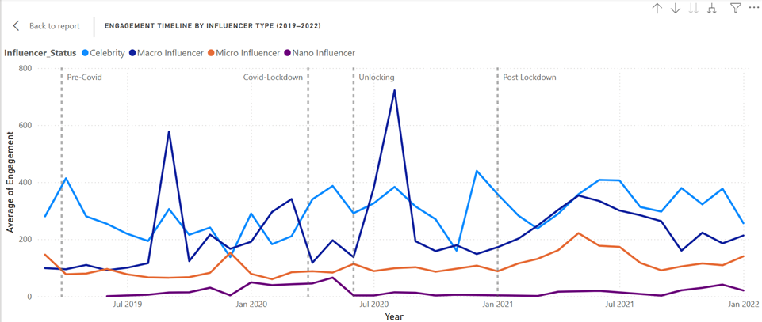

### Findings 

**Pre-Covid Phase (Mar 2019 – Mar 2020):** Engagement started relatively low but showed an early spike around Jul 2019 for Celebrities (~400), suggesting an active pre-pandemic digital environment. All influencer tiers maintained steady but modest engagement levels during this period.

**Covid Lockdown (Mar 2020 – Jun 2020):** Celebrity engagement spiked dramatically to ~575 around Jan 2020 just before lockdown, then experienced the most volatile period in the entire timeline. The biggest spike in the entire dataset occurs around Jul 2020 (~725) — right at the start of Post Lockdown — confirming that lockdown created extraordinary engagement opportunities for Celebrities.

**Unlocking (Jun 2020 – Jan 2021):** Engagement remained elevated but began fluctuating significantly. Celebrities continued dominating while Macro Influencers showed a gradual upward trend, slowly closing the gap.

**Post Lockdown (Jan 2021 – Jan 2022):** Celebrity engagement gradually declined from its pandemic peak but stabilised at a higher level than pre-COVID. Macro Influencers continued their upward trajectory, reaching their highest levels during this phase. Macro Influencers show a clear upward trend, while Micro and Nano Influencers remain relatively flat, indicating that the pandemic's impact on engagement was most pronounced for higher-tier influencers.

## Which Post Type Generates the Highest Engagement?

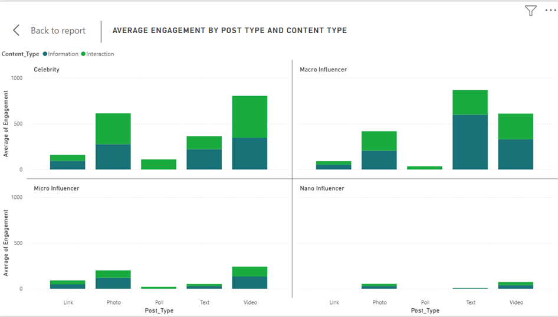

### Findings

For celebrities:

- Video has the highest engagement    
- Photo is second
- Interaction content outperforms Information  across most post types

For macro influencers:

- Video also dominates 
- Photo and Text are strong second options
- Similar pattern to Celebrities — Interaction content leads

For micro influencers:

- Video again leads 
- Much lower overall compared to Celebrity and Macro
- Same Interaction > Information pattern holds

For nano influencers:

- Engagement is very low across all post types
- No single post type clearly dominates
- Barely registers compared to other tiers

## Does Verbosity Impact Engagement Levels on Content Type?

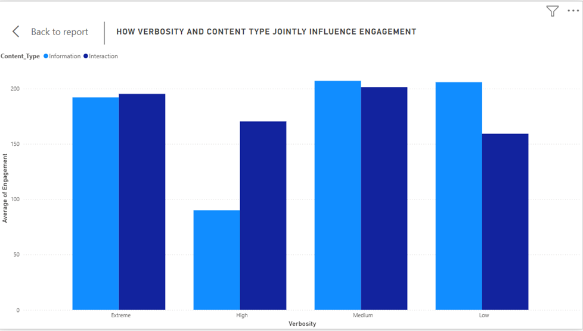

### Findings

Medium verbosity drives the highest overall engagement regardless of content type

Interaction content is more resilient — it performs consistently well across all verbosity levels, never dropping as sharply as Information 

Information content is most vulnerable at High verbosity — it drops significantly, suggesting audiences disengage from purely informational content when verbosity is high but not extreme

At Low verbosity, Information slightly outperforms Interaction — the only level where this reversal occurs

If you want consistent engagement, Interaction content is the safer bet across all verbosity levels. Information content is more volatile — it peaks at Medium and Low but struggles at High verbosity.

## Does Verbosity affect Engagement Differently by Influencer Type?

For this chart, we look at how much influencer posts vs how much their audience interacts. We used Average Engagement scores to make our comparisons fair, regardless of how much each person posts. 

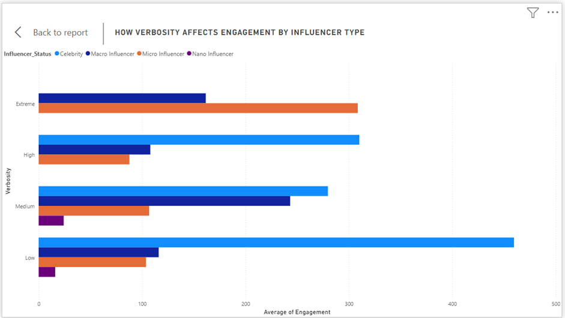

### Findings

**Celebrities:** They don’t need to say much on their social media, hence why their highest engagement is at “Low”, hitting nearly 500 interactions. Interestingly, they completely disappear from the data entirely at the “Extreme” verbosity level, which suggests their audience prefers short, quick updates.

**Micro-Influencers:** They have to work harder, end up seeing an opposite trend where their engagement is low for short posts but takes the lead at “Extreme” verbosity. 

**Macro-Influencers:** They have a middle ground where they perform consistently well but peak when they provide a moderate amount of content, nearly catching up to celebrities at the “Medium” level.

**Nano-Influencer:** Their engagement levels remain low across the board, showing very little change, no matter how much they write. 

## Does Word Count Influence Engagement Levels?

This scatter plot maps out every post by its word count versus the engagement it received. If writing more led to more likes, we would see the dots trending upward as we move to the right. 

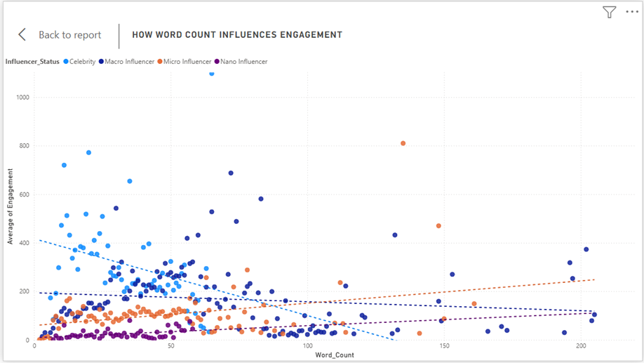

### Findings

Celebrities "break" the chart at low word counts. The highest engagement spikes in the entire study happen when Celebrities say very little, usually under 50 words. 

As we move toward the higher word counts (100–200 words), engagement stays remarkably flat for everyone else. Micro and Nano influencers stay grounded. Regardless of how much they write, these tiers cluster near the bottom of the engagement scale, showing that word count isn't a "ladder" they can use to climb into higher engagement brackets.

There is no meaningful correlation between word count and engagement. The data proves that who is posting is far more important than how much they write. For celebrities, fame acts as an amplifier for even the smallest amount of effort. For smaller influencers, writing longer posts doesn't compensate for a smaller reach.

## Which States have the Highest Engagement?

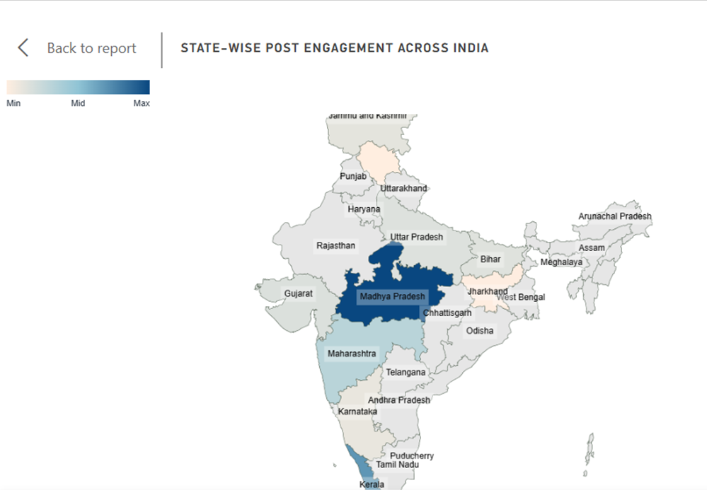

### Findings

**Maharashtra leads:** It has the highest average engagement, driven by a strong presence of Celebrity influencers who generate significant interaction.

**Tamil Nadu and Karnataka follow:** These states also show high engagement levels, likely due to a combination of active influencer communities and engaged audiences.

**Regional disparities:** Engagement levels vary widely across states, suggesting that local factors such as population density, internet penetration, and cultural engagement with social media may play significant roles in driving interaction.

**Celebrity influence:** The states with the highest engagement are also those where Celebrity influencers are most active, reinforcing the idea that influencer presence is a key driver of engagement in these regions. 

## Which Day and Hour has the Highest Engagement across Phases?

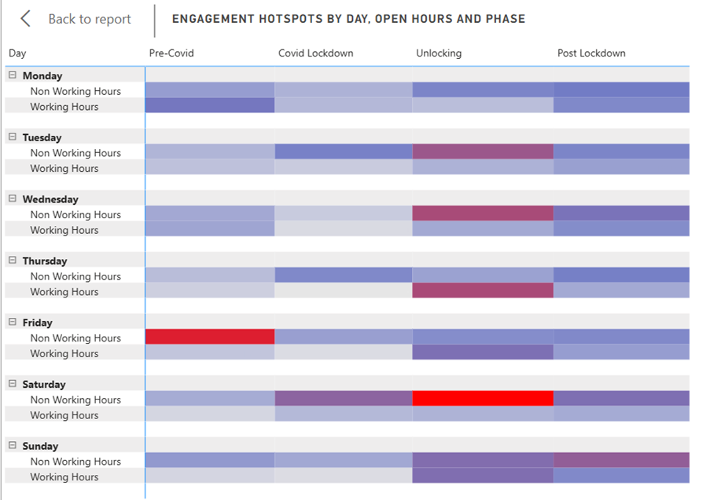

### Findings

**Overall Pattern:** Non-Working Hours consistently outperform Working Hours across every day and every phase. This confirms that people engage with content most during their personal time rather than work hours, regardless of the pandemic phase.

**Friday Evening Peak:** The single highest engagement hotspot is on Fridays during Non-Working Hours in  the Pre-Covid phase (346.45), making it the most active time for engagement in the entire dataset. This suggests that people were most engaged with content at the end of the workweek before the pandemic disrupted normal routines.     

**Saturday Non-Working Hours:** Unlocking is the second highest, suggesting weekend evenings during the return to normalcy were highly active.

**Thursday Working Hours** Unlocking (295.00) is surprisingly high for working hours, suggesting the Unlocking phase drove unusual weekday engagement.

**Covid Lockdown Pattern:** The Covid Lockdown column is consistently the lightest across all days and hours hence confirming our earlier finding that lockdown suppressed engagement across the board regardless of day or time.

**Key Insight:** Engagement follows human behaviour, people interact most with content during their personal time, not work hours. Friday evenings Pre-Covid represented the peak engagement window, while Covid Lockdown flattened all temporal patterns entirely, erasing the natural rhythm of online behaviour.

## What Sentiments do Influencers Express in their Content?

For this chart, we were looking at what sentiment influencers actively express in their own content. The chart compares the average positive and negative sentiment scores across each influencer type, filtered to information-type posts only — that is, content created directly by the influencer.

.png>)

### Findings

Negative expression is identical across all tiers. Every influencer type posts with exactly −1.06. Tier, reach, and fame have zero influence on how negatively influencers frame their content.

Celebrities express the most positivity. At 1.35, Celebrities edge out all other tiers. Micro influencers express the least positivity at 1.24, with Macro and Nano tied at 1.25.

Positivity outweighs negativity for all tiers. Every tier sits net-positive, meaning that regardless of influencer status, content leans more positive than negative overall.

Influencer tier shapes how positively someone expresses themselves, but not how negatively. The negativity floor is universal — suggesting it reflects a general norm of content creation on the platform rather than individual influencer behaviour. Celebrities post the most positively, which may reflect more polished, brand-conscious content strategies rather than genuine differences in sentiment.

## What Sentiment do Audiences Direct Back at Influencers?

For this chart, we examined the sentiment audiences directed at influencers through comments and interactions. The chart compares the average positive and negative sentiment scores across each influencer type, filtered to interaction-type posts only.

.png>)

### Findings 

Negativity is mostly flat, but Nano influencers attract slightly more Celebrities and Micro influencers receive −1.06, while Macro influencers receive the least negativity at −1.04. Nano influencers stand out slightly at −1.09, the highest negative reception of all tiers, which is unexpected given their smaller reach.

Celebrities and Nano influencers receive the most positivity equally. Both sit at 1.38, jointly leading the audience's positive reception. Micro influencers follow at 1.28, while Macro influencers receive the least positivity at 1.22.

Macro influencers have the weakest audience reception overall. They receive the least positivity and the least negativity — suggesting their audiences are the most emotionally neutral or disengaged in their responses.

Unlike expression, reception does vary more noticeably across tiers. The most striking finding is that Nano influencers — despite the smallest reach — attract audience sentiment comparable to Celebrities. This suggests that community closeness at the Nano level drives stronger emotional reactions, both positive and negative, than the middle tiers
