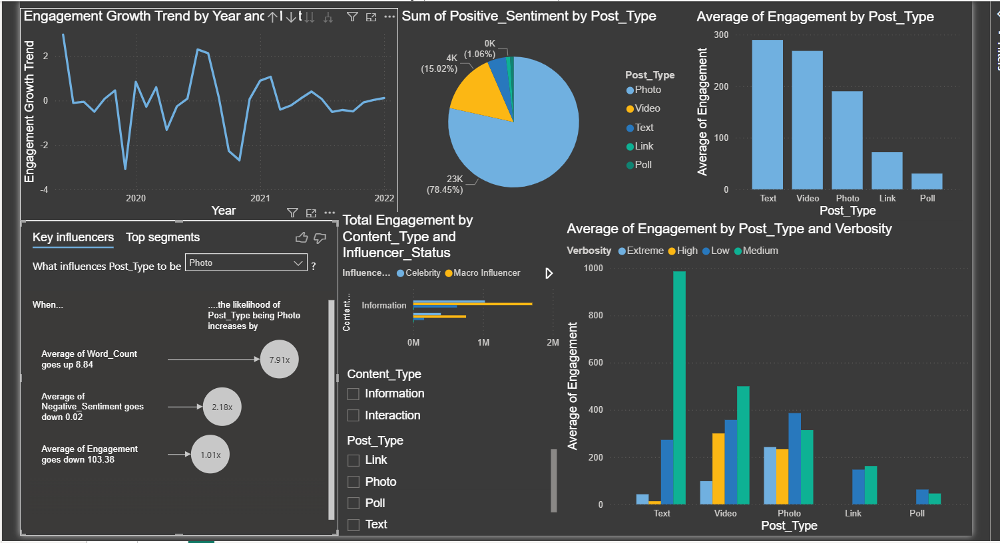

# Dashboard Layout
--- 
--- 

- The dashboard is arranged in a 3×2 grid layout with six visual panels. 
- Visuals are positioned to guide the reader from a high-level time trend (top-left) through categorical breakdowns (top-centre and top-right) and into detailed cross-dimensional analysis (bottom row). 
- The slicer panel (bottom-centre) allows dynamic filtering across all visuals.

### Layout Grid

---
---

* # Visuals

### 1. Line Chart
- Engagement Growth Trend by Year and Month
- Placement: Top-left — primary position, widest visual on the dashboard

#### Why this visual: A line chart is ideal for continuous time-series data because it emphasises the direction and rate of change between data points. Placing it top-left follows the natural F-pattern reading flow, ensuring it is the first visual seen and sets the context for everything else on the page.
---
### 2. Pie Chart
- Sum of Positive Sentiment by Post Type
- Placement: Top-centre — positioned between the trend and bar chart to bridge time context and category context

#### Why this visual: A pie chart is appropriate here because the primary question is proportional composition rather than comparison of magnitudes. With only five post types, the slices remain readable. Placing it at the top-centre draws the eye naturally after scanning the trend, prompting the reader to ask which post type is responsible for that trend.
---
### 3. Bar Chart
- Average of Engagement by Post Type
- Placement: Top-right — completes the top row as a direct companion to the pie chart

#### Why this visual: A vertical bar chart is the clearest way to compare a single numeric measure across discrete categories. Placing it immediately next to the pie chart creates a deliberate tension: Photo has the most volume and sentiment, but Text has the highest average engagement per post — this prompts deeper analysis and is made obvious by the two visuals sharing the same row.

---
### 4. Key Influencers

- Placement: Bottom-left — anchors the analytical insight section of the dashboard

#### Why this visual: The Key Influencers visual performs automated statistical analysis without requiring custom DAX. It surfaces non-obvious relationships that would be hidden in standard charts. Placed bottom-left, it rewards users who scroll down with actionable insight, and pairs logically with the slicer panel beside it for deeper exploration.

---
### 5. Horizontal Bar Chart
- Placement: Bottom-centre — central control panel of the dashboard

#### Why this visual: A horizontal bar chart was chosen over vertical because the category labels (Information, Interaction) are longer text strings that render more clearly on the horizontal axis. Centralising this visual with its slicers makes it the interactive hub of the dashboard — all filters radiate outward to the other visuals, giving users control over the entire analytical view from one location.

---
### 6. Grouped Bar Chart
- Average of Engagement by Post Type and Verbosity
- Placement: Bottom-right — most detail-rich visual, placed last in reading order

#### Why this visual: A grouped bar chart is used when comparing one measure across two categorical dimensions simultaneously. It avoids the need for a matrix table while keeping values visually scannable. Placing it bottom-right positions the most complex visual as the final analytical destination, where users arrive after understanding context from the simpler top-row visuals.
--- 

## Filtering
The dashboard supports dynamic cross-filtering. Clicking any bar, slice, or data point in one visual automatically filters all other visuals to reflect the selected segment. The slicer panel (bottom-centre) provides persistent filters for:

•	Content_Type — filter by Information or Interaction posts
•	Post_Type — filter by Photo, Video, Text, Link, or Poll

The Key Influencers visual also contains a dropdown that lets users change the target variable — switching from “Photo” to another post type will recalculate which factors most predict that type.

