# Data Architecture

## Overview

The data model is designed using a **star schema**. This means there is one main table (fact table) in the center, and several smaller tables (dimension tables) around it.

* The **fact table** stores the main values (like engagement and likes)
* The **dimension tables** describe the data (like date, content type, state, etc.)

All the dimension tables connect to the fact table, which makes it easy to analyze the data from different angles.

## Fact Table

### Fact Table Social Media Engagement

This is the **main table** in the model.

Each row represents **one tweet**.

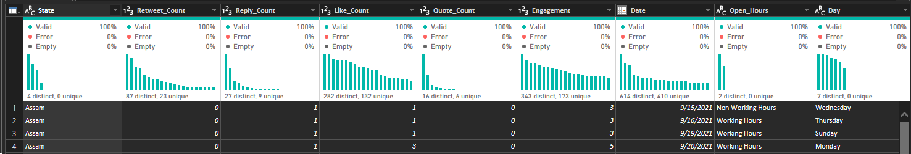

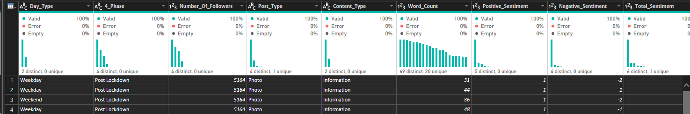

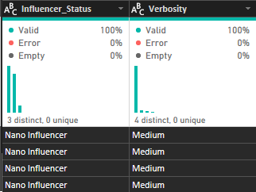

This table is used to:

* Calculate totals (e.g. total engagement)
* Compare values (e.g. engagement by content type)

## Dimension Tables

These tables give **extra information** about the data in the fact table.

### Dimension Table Date

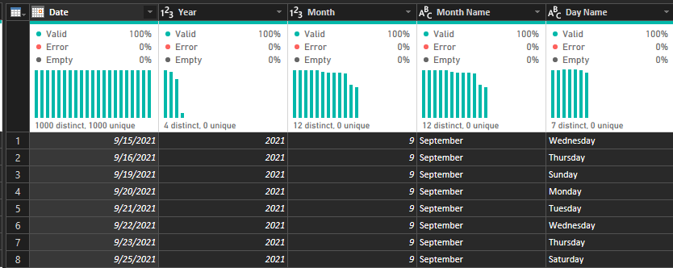

Used to:

* Analyze trends over time
* Compare engagement by month or year

### Dimension Table Day Power Query

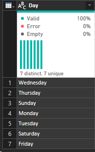

Used to:

* Analyze engagement per day

### Dimension Table Day Type

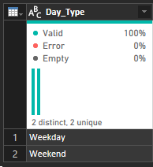

Used to:

* Compare weekend vs weekday performance

### Dimension Table Open Hours

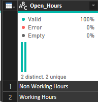

Used to:

* Find the best time to post

### Dimension Table Content Type

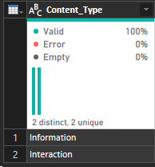

Used to:

* See which content performs best

### Dimension Table Post Type

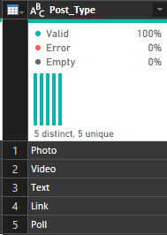

Used to:

* Analyze different types of posts

### Dimension Table State

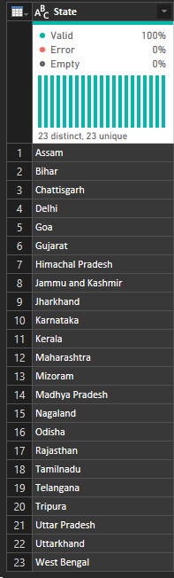

Used to:

* Compare engagement across locations

### Dimension Table Influencer Status

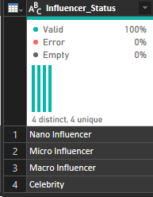

Used to:

* Compare high vs low influence accounts

### Dimension Table Phase

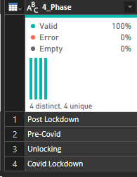

Used to:

* Analyze how engagement changed over time

### Dimension Table Verbosity

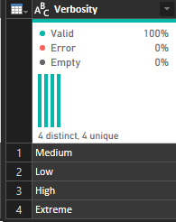

Used to:

* Write something here 

## Relationships

All tables are connected in this way:

**Dimension → Fact (One-to-Many relationship)**

This means:

* One value in a dimension (e.g. one date)
* Can relate to many tweets in the fact table

### Example:

* One date → many tweets
* One content type → many tweets
* One state → many tweets

## Important Points

* All dimension tables connect **only to the fact table**
* Dimension tables do **not connect to each other**
* Filtering always goes from dimension → fact

### Example of how it works

If you select:

* Content Type = Video
* Day Type = Weekend

The model will filter the fact table and show:

* Only weekend video tweets
* Then calculate engagement

## Summary

* The fact table stores **numbers (engagement, likes, sentiment)**
* Dimension tables store **descriptions (date, content type, state, etc.)**
* The model allows you to analyze data from many perspectives easily

