# ETL & Power Query

## Extract

The raw data had 41 columns with redundancy present. Certain columns represented roughly the same thing and were not needed for analysis.

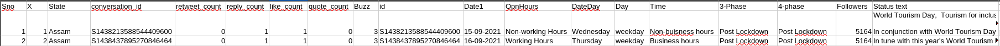

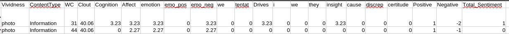

## Transform

### Data Cleaning

#### Dropped Columns

The `Sno` and `X` columns are roughly the same thing. `Sno` handled a continuous count throughout the whole dataset while `X` reset to 1 every time the `State` changed. Moreover, they are not needed thus they were dropped from the dataset.

The `conversation_id` and `id` field are pretty much the same values and are not needed thus they are dropped. The `Status text` field is dropped since sentiment analysis has already been performed on it and hence has become obsolete.

The `3-Phase` and `4-Phase` columns represent roughly the same concepts with `4-Phase` encompassing more categorical splitting of time. Hence, only one is needed and the more descriptive one (`4-Phase`) is retained.

The columns `Time` and `OpnHrs` are the same values in practice hence since `OpnHrs` is a better descriptor it is the one that is retained. The Linguistic Inquiry and Word Count (LWIC) columns except `Positive`, `Negative`, `Total_Sentiment`, and `WC` are dropped since they offer no explaining power for business problems. They are used as intermediate columns to compute the positive, negative, and total sentiments from a piece of content.

#### Renamed Columns

The `Date1` column is renamed to `Date` and `DateDay` to `Day`. The `Day` column is renamed to `Day_Type`. The column `OpnHrs` is renamed to `Open_Hours` to align with good grammar. The `Followers` column is renamed to `Number_Of_Followers` for increased clarity. The `Vividness` column is renamed to `Post_Type` for it to be a lot more functional- since it holds the different media types a post can be. The `WC` column is expanded to `Word_Count`.

While renaming the columns the snake and camel cases were merged thus following the pattern capitalizing the first letter and inserting an underscore between words (`Retweet_Count` for example).

#### Computed Columns

Using the `Number_Of_Followers` column the `Influencer_Status` column was created. The following bands were employed.

- <= 10,000 &rarr; Nano Influencer
- <= 100,000 &rarr; Micro Influencer
- <= 1,000,000 &rarr; Macro Influencer
- \> 1,000,000 &rarr; Celebrity

From these bands, in our entire dataset the _Celebrity_ status was the third highest one. And the _Nano Influencer_ status was the least had the lowest representation.

Using the `Word Count` column the `Verbosity` column was created with the following categories.

- <= 20 &rarr; Low
- <= 60 &rarr; Medium
- <= 120 &rarr; High
- \> 120 &rarr; Extreme

The _Medium_ band holds the largest number of posts.

#### Remapped Columns

The `State` and `Open_Hours` columns had inconsistent naming and abbreviation of values thus they were remapped.

For `State` the map was:

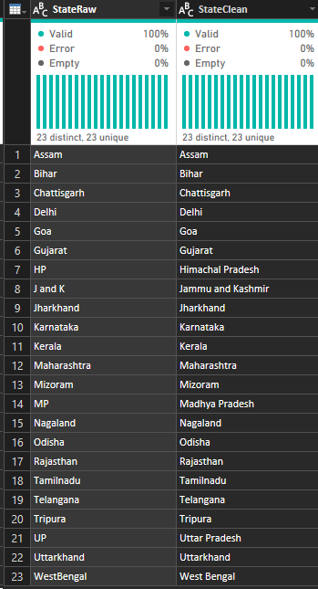

And for `Open_Hours`:

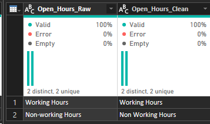

#### Data Type Conversion

| Column Name | Data Type |
| :--- | :--- |
| State | Text |
| Retweet_Count | Whole Number |
| Reply_Count | Whole Number |
| Like_Count | Whole Number |
| Quote_Count | Whole Number |
| Engagement | Whole Number |
| Date | Date |
| Open_Hours | Text |
| Day | Text |
| Day_Type | Text |
| 4_Phase | Text |
| Number_Of_Followers | Whole Number |
| Post_Type | Text |
| Content_Type | Text |
| Word_Count | Whole Number |
| Positive_Sentiment | Whole Number |
| Negative_Sentiment | Whole Number |
| Total_Sentiment | Whole Number |
| Influencer_Status | Text |
| Verbosity | Text |

## Load

### Power Query

#### Fact Table Social Media Engagement

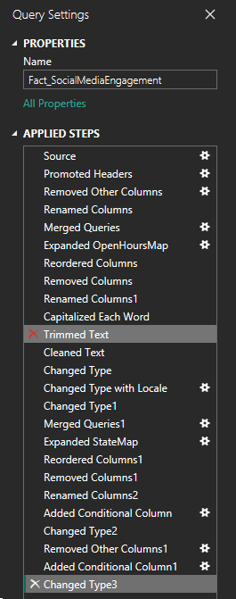

#### Dimension Table State

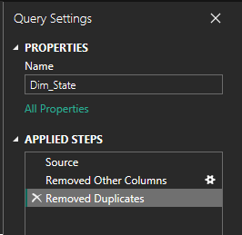

#### Dimension Table Post Type

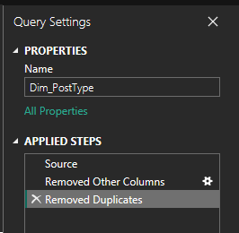

#### Dimension Table Content Type

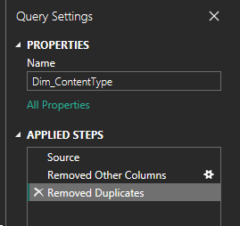

#### Dimension Table Phase

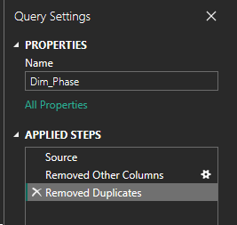

#### Dimension Table Open Hours

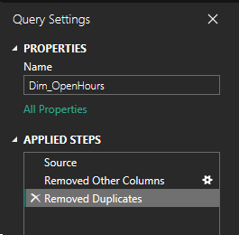

#### Dimension Table Date

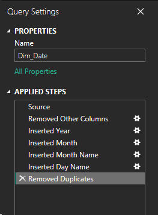

#### Dimension Table Day Power Query

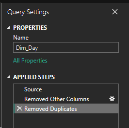

#### Dimension Table Day Type

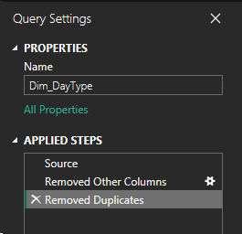

#### Dimension Table Influencer Status

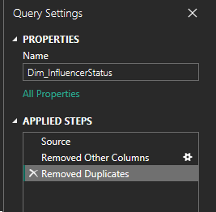

#### Dimension Table Verbosity

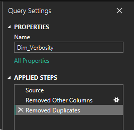
