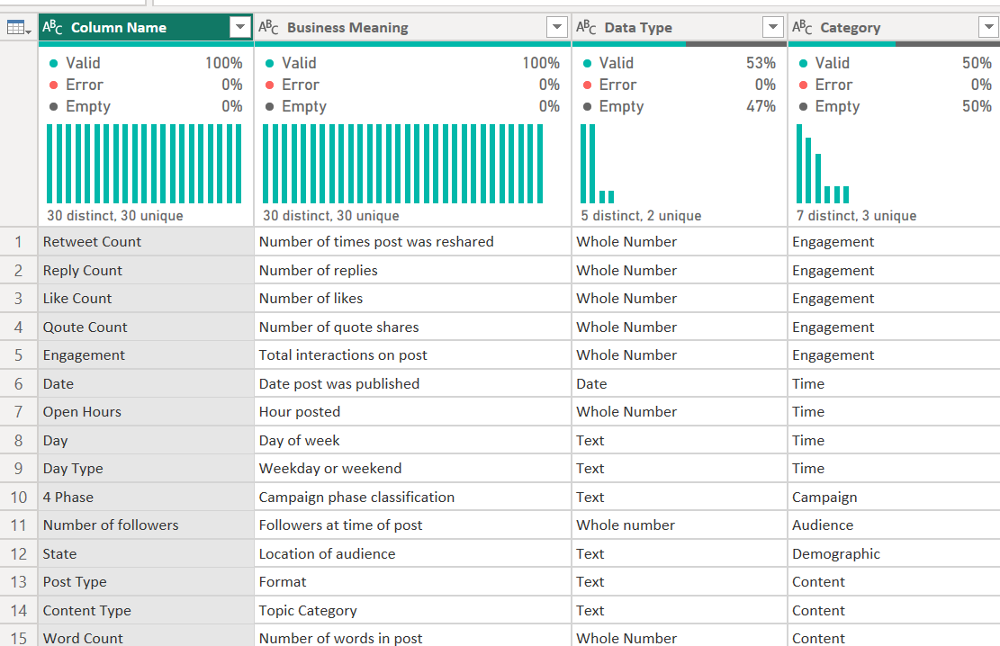
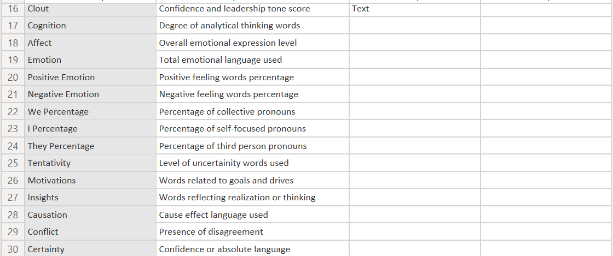

# Data Dictionary

This provides a detailed description of all variables used in the Social Media Engagement dataset obtained from Kaggle. The purpose of this data dictionary is to enhance data understanding, ensure consistency and support effective analysis.

The dataset captures social media performance using engagement metrics, temporal variables, audience characteristics, content attributes, sentiment scores and linguistic features derived from LIWC analysis.

While variables such as likes, retweets, replies and follower counts quantify observable user interactions, they do not fully explain the underlying drivers of engagement. To address this gap the dataset incorporates LIWC based variables that model the psychological, emotional and communicative properties of text.

These models allow analysts to move beyond surface level metrics and examine how language itself shapes audience perception, interaction and behavioral response. The data dictionary therefore plays a critical role in translating these complex variables into meaningful interpretations that can be applied within Power BI for reporting and decision making.
The psychological process model captures the emotional and cognitive dimensions of language, focusing on how individuals express feelings and thoughts within social media content. Variables such as affect, emotion, positive emotion and negative emotion quantify the intensity and polarity of emotional expression, enabling analysts to distinguish between content that evokes positive reactions, such as 3, 2 and 1 and content that conveys negativity, such as -3, -2 or -1. Cognition extends this analysis by measuring the degree of analytical thinking present in the text, reflecting the use of reasoning, problem solving and intellectual framing.This model is particularly valuable in understanding the balance between emotional appeal and rational communication, as highly emotional posts may drive immediate engagement, while cognitively rich posts may foster deeper audience reflection and long term value. By interpreting these variables collectively, analysts can identify whether emotional resonance or intellectual depth is more effective in influencing engagement outcomes.

The social language model examines how language reflects interpersonal relationships and social orientation, primarily through the use of pronouns. Variables such as we percentage, I percentage and they percentage provide insight into whether content is framed collectively, personally or externally. A higher use of (we) indicates inclusive and community oriented messaging, which can strengthen audience connection and foster a sense of belonging. A higher (I) percentage reflects a personal or individualistic tone, often associated with storytelling, personal experiences or influencer driven content. The use of (they) suggests a focus on external groups or third parties which may introduce elements of comparison, distinction or even criticism. This model is essential for understanding how linguistic framing influences audience engagement as different social orientations can evoke varying emotional and behavioral responses. For instance, inclusive language may enhance trust and loyalty while personal narratives may increase relatability and authenticity.

The cognitive and reasoning model explores how ideas are structured, communicated and interpreted within text, emphasizing the role of logical and reflective language. Variables such as insights, causation, tentativity and certainty capture distinct aspects of thinking and reasoning. Insight related words indicate moments of realization or understanding, suggesting that the content encourages reflection or learning. Causation measures the presence of cause and effect relationships, highlighting whether the text provides explanations or logical arguments. Tentativity reflects uncertainty or openness, often expressed through words like ‘maybe’ or ‘perhaps’ while certainty conveys confidence and decisiveness through definitive language. This model provides a understanding of how communication style influences audience perception, as content that balances clarity with openness may be perceived as both credible and engaging. Us analysts can use these variables to determine whether audiences respond more positively to assertive, confident messaging or to exploratory, thought provoking content.

The motivation and influence model focuses on the expression of goals, intentions and persuasive power within language, capturing how content inspires action and conveys authority. The motivations variable identifies language related to desires, ambitions and goal oriented thinking, reflecting the extent to which content encourages forward looking behavior or aspiration. Clout, on the other hand, measures the level of confidence, leadership, and influence embedded in the text. High clout scores indicate authoritative and self assured communication, which can enhance credibility and persuasion, particularly in marketing or leadership contexts. This model is critical for understanding how language drives behavioral outcomes, as motivational and high-clout messaging is often associated with increased engagement, conversions and trusting the audience. By analyzing these variables, organizations can refine their communication strategies to emphasize empowerment, confidence and clear calls to action.

The conflict and interaction model captures the presence of tension, disagreement or opposition within content, providing insight into how controversial or confrontational language influences engagement. The conflict variable identifies words and expressions associated with argument, criticism or debate highlighting whether the content introduces opposing viewpoints or challenges existing perspectives. Conflict driven content can attract attention and stimulate interaction, it also carries potential risks, including negative sentiment, audience polarization and reputational damage. This model is particularly relevant in the context of social media, where provocative or controversial posts often generate high levels of engagement but may not always align with brand objectives. By incorporating this variable into analysis, analysts can evaluate the trade off between visibility and sentiment, helping organizations make informed decisions about the tone and positioning of their content.

The sentiment model provides a consolidated measure of the overall emotional tone of content, simplifying complex linguistic patterns into interpretable scores. Variables such as positive sentiment, negative sentiment, and total sentiment summarize the emotional direction and intensity of text, offering a high-level view of how content is likely to be perceived by audiences.The more granular emotional variables in the psychological process model, sentiment scores aggregate multiple dimensions of language into a single metric, making them particularly useful for comparative analysis and dashboard visualization in Power BI. Positive sentiment typically indicates favorable reception and alignment with audience expectations, while negative sentiment may signal dissatisfaction or controversy. Total sentiment provides a net measure, balancing positive and negative influences to give an overall assessment of tone. This model is essential for quickly identifying trends, benchmarking performance and guiding strategic decisions related to content creation and audience engagement.
THANK YOU!
